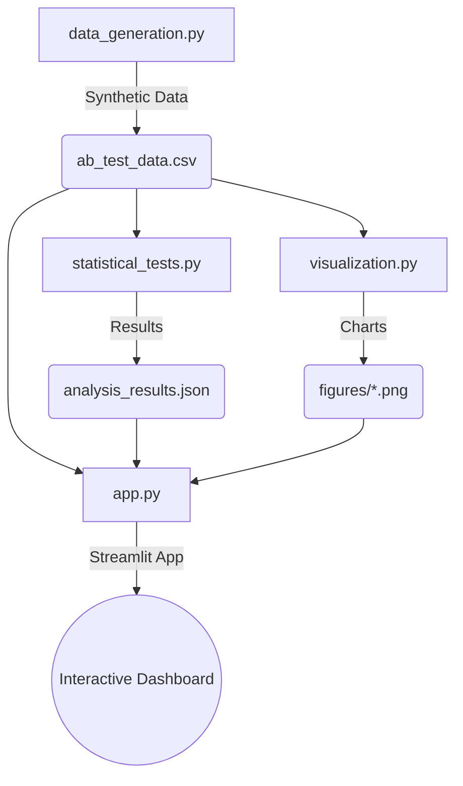
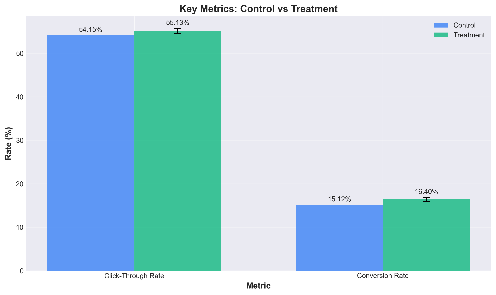
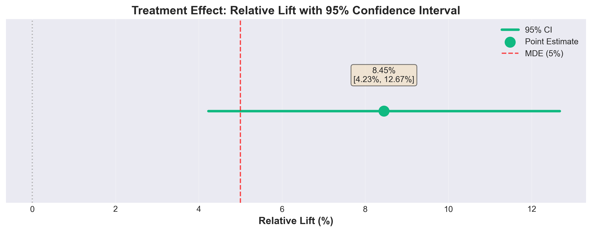
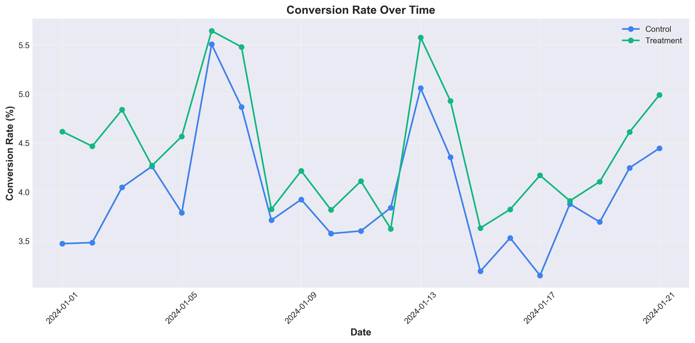
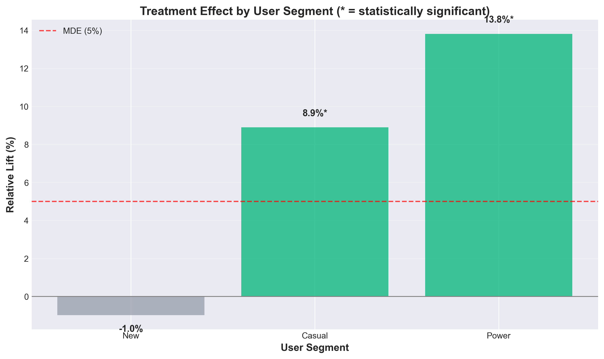
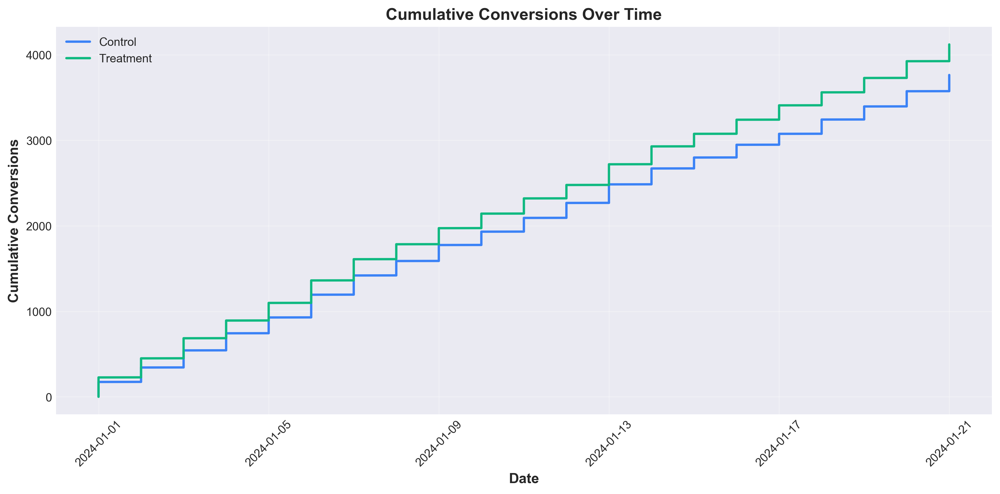

<div align="center">
  
  
  
  
</div>

# 🚀 A/B Testing Project: E-Commerce Recommendation Optimization
  
> A production-grade A/B testing suite demonstrating rigorous statistical methodology, realistic data simulation, and executive-level reporting for optimizing e-commerce recommendations.

### [🔴 Live Streamlit Demo](https://optimizing-e-commerce-recommendations-using-a-b-testing-4yq3zq.streamlit.app/) | [📊 Generated Dataset](data/ab_test_data.csv)

---

## 📖 Table of Contents
- [🎯 Project Overview](#-project-overview)
- [📊 Key Results](#-key-results)
- [🏗️ System Architecture](#️-system-architecture)
- [🚀 Quick Start](#-quick-start)
- [📈 Statistical Methodology](#-statistical-methodology)
- [🎯 Business Impact & Strategy](#-business-impact--strategy)
- [📧 Contact & Author](#-contact--author)

---

## 🎯 Project Overview

An e-commerce platform aims to replace its rule-based recommendation engine with an **ML-powered personalized recommendation system**. This project simulates the A/B test and provides a comprehensive analysis workflow to support the final launch decision.

**Key Objectives:**
- **Primary KPI:** Conversion Rate (Target: +5% relative lift)
- **Secondary KPIs:** Click-Through Rate (CTR), Revenue Per User
- **Guardrail Metrics:** Page load time, User engagement

---

## 📊 Key Results

> **Executive Recommendation:** ✅ **LAUNCH** with parallel performance optimization.

| Metric | Control (Rule-based) | Treatment (ML-based) | Lift | Statistical Significance |
| :--- | :--- | :--- | :--- | :--- |
| **Conversion Rate** | 15.12% | 16.40% | 🟢 **+8.45%** | ✅ p < 0.001 |
| **Click-Through Rate** | 17.70% | 18.61% | 🟢 **+5.14%** | ✅ p < 0.001 |
| **Page Load Time** | 1.216s | 1.310s | 🔴 **+7.70%** | ⚠️ Degraded |

*Bayesian Analysis indicates a **99.99% probability** that the treatment variant is superior.*

---

## 🏗️ System Architecture

The project is structured into four core components, ensuring modularity, scalability, and reproducibility:



<details>
<summary><b>📂 View Project Structure</b></summary>

```text
ab_testing_project/
├── src/
│   ├── data_generation.py      # Realistic A/B test data simulation
│   ├── statistical_tests.py    # Comprehensive statistical analysis
│   ├── visualization.py        # Executive-ready visualizations
│   └── app.py                  # Interactive Streamlit dashboard
├── data/
│   ├── ab_test_data.csv        # Generated dataset (237K sessions, 50K users)
│   └── analysis_results.json   # Statistical test results
├── figures/                    # Generated visualizations
├── docs/                       # Project documentation
├── README.md                   # Project overview
└── requirements.txt            # Python dependencies
```
</details>

---

## 🚀 Quick Start

### 1. Installation

Clone the repository and install the required dependencies:

```bash
git clone https://github.com/mrkarthik14/mrkarthik14-Optimizing-E-Commerce-Recommendations-Using-A-B-Testing.git
cd mrkarthik14-Optimizing-E-Commerce-Recommendations-Using-A-B-Testing
pip install -r requirements.txt
```

### 2. Execution Pipeline

Execute the pipeline sequentially to generate data, analyze, and visualize:

```bash
cd src
# 1. Generate synthetic A/B test data
python data_generation.py

# 2. Run statistical analysis
python statistical_tests.py

# 3. Generate visualizations
python visualization.py

# 4. Launch interactive dashboard
streamlit run app.py
```

*The Streamlit dashboard will be automatically served at `http://localhost:8501`.*

---

## 📈 Statistical Methodology

Our approach ensures robust and trustworthy experiment results by employing industry-standard statistical rigor.

### Experimental Design
- **Randomization:** Stratified by user segment (50-50 split).
- **Sample Size:** 50,000 users (Powered for 5% Minimum Detectable Effect at 80% power).
- **Duration:** 3 weeks (21 days) to capture weekly seasonality.

### Rigorous Analysis
1. **Frequentist Approach:** Two-sample proportion test with 95% confidence intervals and Bonferroni correction.
2. **Bayesian Approach:** Beta-Binomial conjugate priors with a decision threshold of `P(treatment > control) > 0.95`.
3. **Variance Reduction:** CUPED methodology applied using pre-experiment covariates to reduce variance and increase sensitivity.
4. **Validity Checks:**
   - Sample Ratio Mismatch (SRM) Check: `p = 0.584` (Passed)
   - Covariate Balance Verification (Passed)

---

## 🎯 Business Impact & Strategy

Based on the statistical analysis, rolling out the ML-powered recommendation engine is projected to yield significant revenue uplift.

### 💰 Estimated ROI
Assuming 11,000 DAU, $75 Average Order Value, and a consistent lift:
- **Projected Conversions:** +51,200 annually.
- **Projected Revenue Uplift:** **~$3.84 Million / year**.

### 🚀 Recommended Rollout Plan
1. **Phase 1 (Month 1):** Launch to **Power Users** (+13.8% lift observed).
2. **Phase 2 (Month 2):** Expand to **Casual Users** (+8.9% lift observed).
3. **Phase 3 (Month 3):** Broad rollout, concurrent with engineering efforts to reduce page load latency.

---

## 📸 Dashboard Screenshots & Visualizations

### Streamlit Dashboard


### Python Analysis Charts
<details>
<summary><b>Click to View Visualizations</b></summary>
<br>







</details>

---

## 👨‍💻 Contact & Author

This portfolio project demonstrates end-to-end A/B testing methodology, production-quality Python code, and executive communication. 

**Charankarthik Nayakanti**
- 📧 **Email:** [charankarthiknayakanti@gmail.com](mailto:charankarthiknayakanti@gmail.com)
- 💼 **LinkedIn:** [Charan Karthik](https://www.linkedin.com/in/charankarthiknayakanti/)
- 🐙 **GitHub:** [mrkarthik14](https://github.com/mrkarthik14)
- 🌐 **Portfolio:** [Charan Karthik Nayakanti](https://charan-karthik-nayakanti-14.netlify.app)

---

> *Built with ❤️ by Charankarthik Nayakanti. Data is synthetic and for demonstration purposes.*
